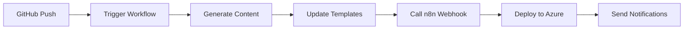

# 🚀 GitHub Actions Secrets Setup Guide

## Required Secrets Configuration

यहाँ आपको GitHub repository में जाना होगा: **Settings → Secrets and Variables → Actions**

### 1. 🔑 API Keys

#### OPENAI_API_KEY
```
Name: OPENAI_API_KEY
Value: sk-xxxxxxxxxxxxxxxxxxxxxxxxxxxxxxxxxxxxxxxx
Description: OpenAI API key for GPT-based content generation
```

**कैसे प्राप्त करें:**
1. [OpenAI Platform](https://platform.openai.com/) पर जाएं
2. API Keys section में जाकर नया key बनाएं
3. Key को safely store करें (यह सिर्फ एक बार दिखेगी)

#### GEMINI_API_KEY  
```
Name: GEMINI_API_KEY
Value: AIzaSyxxxxxxxxxxxxxxxxxxxxxxxxxxxxxxxx
Description: Google Gemini API key for AI content generation
```

**कैसे प्राप्त करें:**
1. [Google AI Studio](https://makersuite.google.com/) पर जाएं
2. Get API Key पर click करें
3. नया API key generate करें

### 2. 🌐 n8n Webhook Configuration

#### N8N_WEBHOOK_URL
```
Name: N8N_WEBHOOK_URL  
Value: https://your-n8n-domain.com
Description: Base URL for n8n webhook automation
```

**n8n Setup Steps:**
1. n8n में नया workflow बनाएं
2. Webhook node add करें:
   - Method: POST
   - Path: `balaji-automation`
3. Workflow save करें और Production URL copy करें
4. URL को GitHub secrets में add करें

### 3. ☁️ Azure Deployment (Optional)

#### AZURE_PUBLISH_PROFILE
```
Name: AZURE_PUBLISH_PROFILE
Value: <PublishProfile>...</PublishProfile>
Description: Azure Functions deployment profile
```

**या**

#### AZURE_CREDENTIALS
```
Name: AZURE_CREDENTIALS
Value: {
  "clientId": "xxxx",
  "clientSecret": "xxxx", 
  "subscriptionId": "xxxx",
  "tenantId": "xxxx"
}
Description: Azure service principal for deployment
```

## 📋 Complete Setup Checklist

### Step 1: n8n Webhook Setup
- [ ] n8n account बनाएं या login करें
- [ ] नया workflow create करें
- [ ] Webhook node add करें (POST, path: `balaji-automation`)
- [ ] Workflow save करें
- [ ] Production URL copy करें
- [ ] GitHub secrets में `N8N_WEBHOOK_URL` add करें

### Step 2: AI API Keys
- [ ] OpenAI account बनाएं और API key generate करें
- [ ] Google AI Studio से Gemini API key प्राप्त करें
- [ ] दोनों keys को GitHub secrets में add करें

### Step 3: Azure Setup (Optional)
- [ ] Azure Functions app बनाएं
- [ ] Publish profile download करें
- [ ] GitHub secrets में add करें

### Step 4: GitHub Repository Settings
- [ ] Repository → Settings → Secrets and Variables → Actions
- [ ] सभी required secrets add करें
- [ ] Workflow permissions check करें

## 🔧 Environment Variables Template

`.env` file example:
```env
# AI API Keys
OPENAI_API_KEY=sk-xxxxxxxxxxxxxxxxxxxxxxxxxxxxxxxxxxxxxxxx
GEMINI_API_KEY=AIzaSyxxxxxxxxxxxxxxxxxxxxxxxxxxxxxxxx

# n8n Configuration  
N8N_WEBHOOK_URL=https://your-n8n-domain.com
N8N_WEBHOOK_PATH=balaji-automation

# Azure (Optional)
AZURE_FUNCTIONAPP_NAME=your-app-name

# Development
NODE_ENV=production
LOG_LEVEL=info
```

## 🧪 Testing Your Setup

### 1. Test n8n Webhook
```bash
curl -X POST \
  -H "Content-Type: application/json" \
  -d '{"test": "automation"}' \
  "https://your-n8n-domain.com/webhook/balaji-automation"
```

### 2. Check GitHub Actions
1. Repository में कोई change commit करें
2. Actions tab में जाकर workflow देखें
3. Logs में success/error messages check करें

### 3. Verify API Keys
- OpenAI key test करने के लिए simple API call करें
- Gemini key verify करने के लिए test request भेजें

## 🚨 Security Best Practices

### API Key Security
- ✅ कभी भी API keys को code में hardcode न करें
- ✅ Regular rotation करें (monthly)
- ✅ Minimum required permissions दें
- ✅ Usage monitoring enable करें

### GitHub Secrets
- ✅ Repository secrets का use करें (not environment variables in code)
- ✅ Descriptive names दें
- ✅ Documentation maintain करें
- ✅ Team members को appropriate access दें

## 🔄 Automation Workflow Overview



### Workflow Triggers:
- **Manual**: `workflow_dispatch` event
- **Daily**: Scheduled at 9 AM IST
- **Push**: On master/main branch
- **Pull Request**: For testing

### Automation Actions:
1. 📝 Generate AI-powered portfolio content
2. 📱 Update social media templates
3. 🔗 Trigger n8n workflow via webhook
4. ☁️ Deploy to Azure Functions (if configured)
5. 📊 Generate analytics report
6. 💬 Send completion notifications

## 📞 Support & Troubleshooting

### Common Issues:

#### Webhook Not Triggering
- n8n URL में `/webhook/` path missing
- CORS issues - n8n में proper headers set करें
- Network connectivity problems

#### API Keys Not Working
- Key format incorrect (extra spaces/characters)
- Usage limits exceeded
- Key expired या revoked

#### GitHub Actions Failing
- Secrets properly configured नहीं हैं
- Workflow permissions insufficient
- Repository settings में Actions disabled

### Getting Help:
1. GitHub Actions logs देखें
2. n8n execution logs check करें  
3. API provider की status page देखें
4. Documentation को carefully re-read करें

## 🎯 Next Steps After Setup

1. **Test the Complete Flow**:
   - Manual workflow trigger करें
   - सभी steps का output verify करें
   - Generated content को review करें

2. **Customize for Your Needs**:
   - AI prompts को modify करें
   - Social media templates personalize करें
   - n8n workflow में additional nodes add करें

3. **Monitor and Optimize**:
   - Daily automation results track करें
   - Performance metrics monitor करें
   - Based on results, prompts improve करें

**🚀 Ready to automate your career growth with AI!**